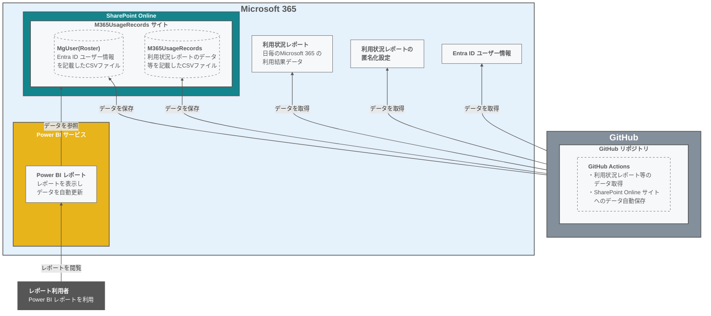
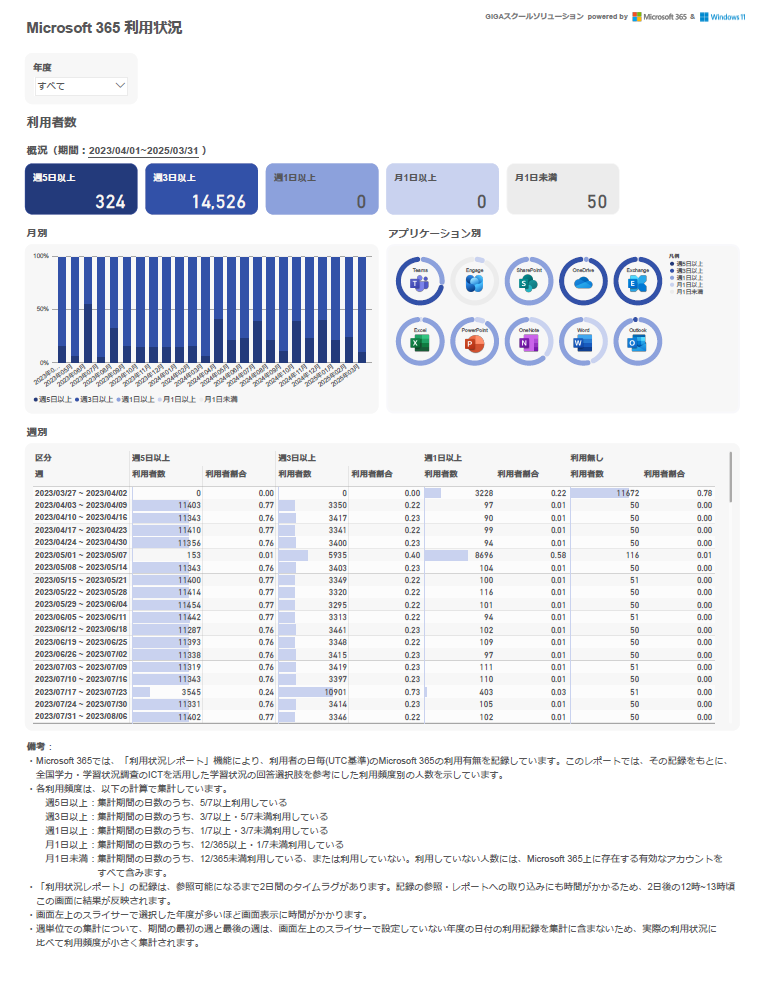
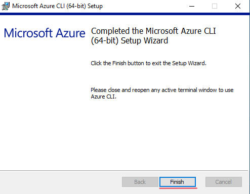
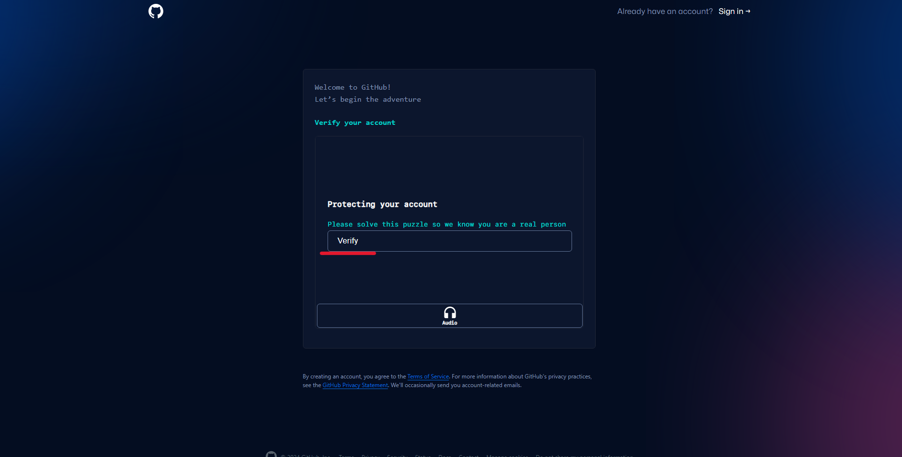
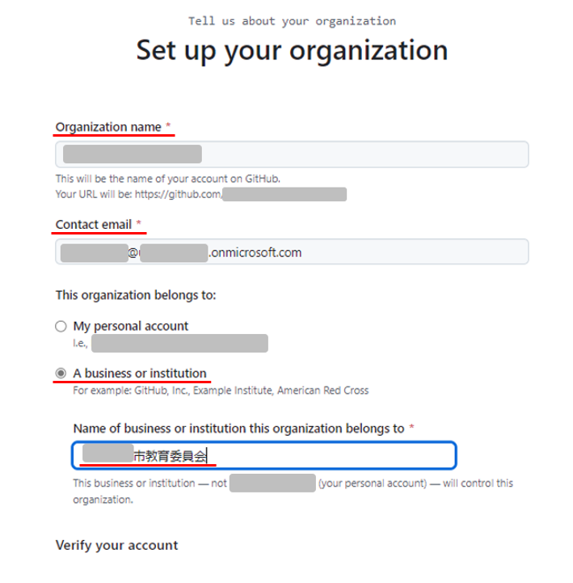
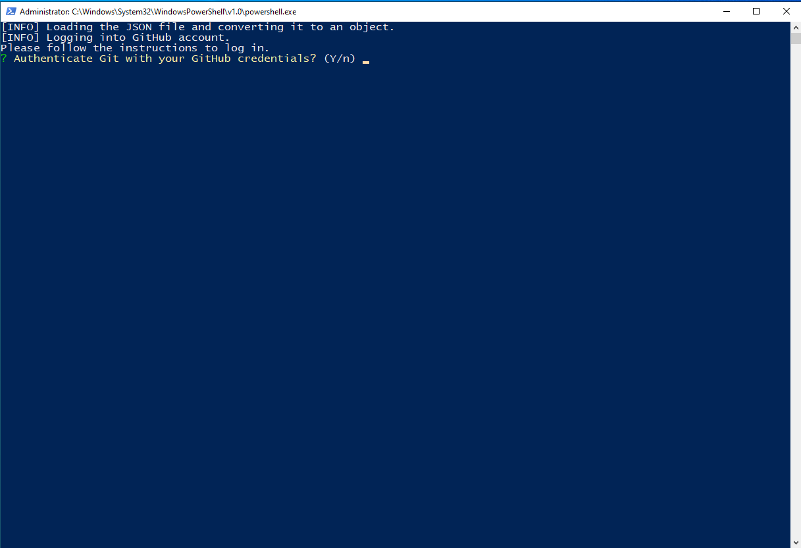
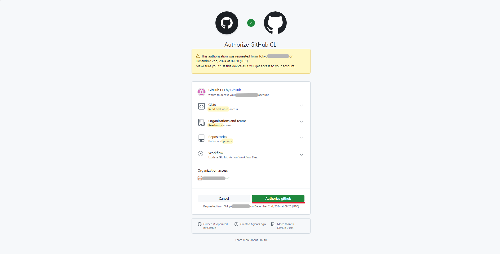
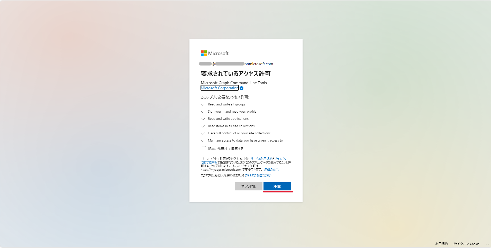
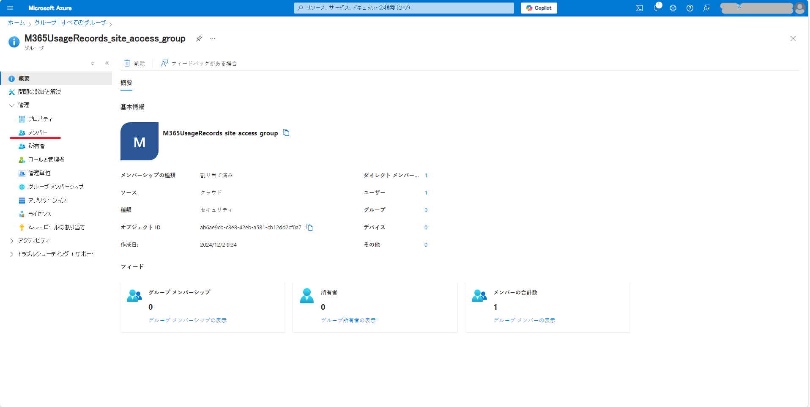

<a name="top"></a>
<div align="right">
  
  
  
</div>

# Microsoft 365 利用状況可視化テンプレート
GitHubとMicrosoft 365 の機能を組み合わせ、Microsoft GIGAスクールパッケージの利用状況を蓄積・可視化するためのテンプレートです。
このREADMEでは、本テンプレートの概要や利用状況の蓄積に必要な環境構築手順を示します。  
  
<br/>
  
## 目次

- [本プロジェクトについて](#-本プロジェクトについて)
- [環境構築手順](#-環境構築手順)
- [各レポートの利用方法](#-各レポートの利用方法)
- [データソースへのアクセス権設定](#-データソースへのアクセス権設定)
- [関連情報](#-関連情報)
  
<br/>
  

## 🚀 本プロジェクトについて

### 背景

文部科学省の[GIGAスクール構想の実現 学習者用コンピュータ最低スペック基準の一部訂正について（依頼）](https://www.mext.go.jp/content/20240201-mxt_shuukyo01-000033777_01.pdf)には、GIGAスクール構想で普及した端末の利用状況を把握する機能が必要であると記載されています。

> **2.9. 端末の稼働状況を把握できる機能について**
> 
> 本機能は、プライバシー保護に十分留意した上で、端末の利活用状況を客観的に把握するために具備する必要がある（文部科学省による端末の利活用状況の調査において、こうした客観的データに基づく回答を求めることとなる。）...

Microsoft 365 を利用している場合は、その利用ログから端末の利活用状況を把握することができます。  
しかし、Microsoft 365 の[利用状況レポート機能](https://learn.microsoft.com/ja-jp/microsoft-365/admin/activity-reports/activity-reports?view=o365-worldwide)や[監査ログ機能](https://learn.microsoft.com/ja-jp/purview/audit-log-retention-policies?tabs=microsoft-purview-portal#default-audit-log-retention-policy)は単体では、本テンプレート作成時点では長期のログの保管・可視化ができません。
この問題を解決するため、Microsoft 365 の最小のライセンス構成(=A1ライセンス)での利用ログの長期保管や可視化ができるサンプルとして本テンプレートを公開します。


### 目的

本テンプレートの目的は以下の通りです。

- **Microsoft 365 利用状況レポートのデータ蓄積**:  
GIGAスクール構想で導入したMicrosoft 365 テナントの利用状況を年度単位で客観的に把握できるよう、日毎の利用状況レポートのデータをSharePoint Online サイトに長期的に保管可能とします。
- **蓄積したデータの可視化**:  
蓄積されたデータをPower BI を使ってわかりやすく可視化します。本テンプレート作成時点の文科省による利活用状況の調査例として、[全国学力・学習状況調査学校質問紙](https://www.nier.go.jp/24chousa/pdf/24shitsumonchousa_shou_gakkou.pdf)のICT機器の活用に対する設問を考慮し、人毎の利用頻度に基づいた可視化を行います。


### 概要

本テンプレートを導入することで、導入者が管理するMicrosoft 365 上に利用状況レポートとその周辺データを保管するためのSharePoint Online サイトが開設されます。また、同じく導入者が管理するGitHub上に、各種データの参照・蓄積に必要なジョブを自動実行するためのGitHub Actionsが展開されます。日次でGitHub Actionsが自動実行されることで、SharePoint Online サイト上に日次のデータが保管されるようになります。  
  
また、手順に従ってPower BI をセットアップすることで、導入者のPower BI マイワークスペース上にデータを可視化するレポートが展開されます。日次でPower BI のデータ更新が自動実行されることで、レポートの内容も自動更新されるようになります。利用状況レポートの仕様や各種更新処理の都合から、レポートの内容は毎日正午12時過ぎに更新され、UTC基準の日付で2日前のデータまで表示されるようになります。    

導入後に開設されるシステムの構成図を以下に示します。  

**【システム構成図】**


**【レポート画面】**
  ||
  |---------|  


### 👨‍💻👩‍💻 対象者
Microsoft 365 のグローバル管理者アカウントが利用可能なテナントのシステム管理者  


### ✅ 前提条件  
1. **PC**  
セットアップ用のスクリプト実行やPower BI Desktop を利用するため、以下の要件を満たすPCを用意します。  

    | OS | 動作確認済みのバージョン |
    |:-|:-|
    | Windows 10 | 22H2 |
    | Windows 11 | 24H2 |

> [!IMPORTANT]
> PCのシステムロケールが日本である必要があります。

2. **ネットワーク**  
資源のインストールやAPI実行を行うため、インターネット接続ができる環境を用意します。  
  
3. **Microsoft 365 ライセンス**  
本プロジェクトのレポートを活用するためには、最低でもMicrosoft 365 A1 ライセンスが必要です。  
  
4. **Microsoft 365 アカウントおよびグループ**  
本プロジェクトの可視化テンプレートの利用に際しては、初回のみ本READMEに従ってMicrosoft 365 のログを蓄積するための環境構築が必要です。  
環境構築の作業者とレポート利用者では、前提条件に違いがあります。

    | 利用者種別 | 前提条件 |
    |:-|:-|
    | 環境構築の作業者 | Microsoft 365 のグローバル管理者アカウントが利用可能である。 |
    | レポート利用者   | Entra ID セキュリティグループの"**M365UsageRecords_site_access_group**"に属していること。グループへのメンバー追加は、環境構築後の[データソースへのアクセス権設定](#-データソースへのアクセス権設定)にて行います。 |
> [!NOTE]
> 環境構築の作業者については、環境構築時に自動的に"M365UsageRecords_site_access_group"に追加されます。  

> [!CAUTION]
> レポートにはMicrosoft 365 利用状況レポートのデータが含まれるため、該当データを参照可能な[管理者アカウント](https://learn.microsoft.com/ja-jp/microsoft-365/admin/activity-reports/activity-reports?view=o365-worldwide#who-can-see-reports)の保有者にのみレポートの利用を許可することを推奨します。  他のアカウントにレポートの利用を許可したい場合は、組織のセキュリティポリシーを考慮の上ご利用ください。  
  
5. **その他**  
レポートの種類ごとに、前提となる設定や運用に違いがあります。  
    
    | レポート種別 | 想定利用者 | ログ匿名化設定(※1) | 名簿情報の運用(※2)  |
    |:-|:-|:-|:-|
    | [010_テナントの利用状況可視化サンプル](./src/010_テナントの利用状況可視化サンプル/README.md) | テナントのシステム管理者 | 有効 or 無効 | 無 |
    | [020_学校毎の利用状況可視化サンプル](./src/020_学校毎の利用状況可視化サンプル/README.md)   | テナントのシステム管理者 | 無効 | 有 |

**※1 ログ匿名化設定**:  
2021年9月1日以降、Microsoft 365 上の利用状況レポートのユーザー識別情報は既定で匿名化されています。  
学校毎の利用状況を集計する場合は、[匿名化をオフにする](https://learn.microsoft.com/ja-jp/microsoft-365/troubleshoot/miscellaneous/reports-show-anonymous-user-name#resolution)必要があります。  

**※2 名簿情報の運用**:  
学校毎の利用状況を集計する場合は、Microsoft 365 アカウントごとの学校等の所属情報が必要となります。  
Microsoft 365 テナントによって所属情報の運用方法は異なるため、本テンプレートではMicrosoft 365 上の所属情報は参照せず、別途[所属情報の名簿をExcelで作成](./src/020_%E5%AD%A6%E6%A0%A1%E6%AF%8E%E3%81%AE%E5%88%A9%E7%94%A8%E7%8A%B6%E6%B3%81%E5%8F%AF%E8%A6%96%E5%8C%96%E3%82%B5%E3%83%B3%E3%83%97%E3%83%AB/README.md#1-%E5%90%8D%E7%B0%BF%E3%83%95%E3%82%A1%E3%82%A4%E3%83%AB%E3%81%AE%E6%BA%96%E5%82%99)する構成としています。**名簿は少なくとも年度ごとに1つ登録する必要があります。**  
  
<br>
  
## 📝 環境構築手順

以下に利用状況の蓄積に必要な環境構築の手順を示します。  
本手順実施後、別途レポートの利用方法に従ってレポートの構築も実施してください。  
> [!NOTE]
> 手順の中のスクリーンショットは2024/12/02時点での画面です。現在の画面とは異なる場合がございます。
  
### 1. 環境構築に必要なツールのインストール

環境構築を行うために、事前に以下に示すツールが必要です。未インストールの場合やバージョンが古い場合は以下の手順でインストールします。

- Gitのインストール

Windows PowerShell で以下のコマンドを実行します。  
```shell
winget install --id Git.Git -e --source winget
```
※動作確認済のバージョン：2.47.0.windows.2  


コマンドが実行できなかった場合は、[こちら](https://gitforwindows.org/)から.exeファイルをダウンロード後、以下の手順でインストールを行います。

<details>
<summary>クリックして手順を表示　</summary>
    
> 1. ダウンロードした.exeファイルをダブルクリックして実行します。
> 2. デフォルトの設定から変更せず、[Install] が表示されるまで [Next] をクリックします。  
> 
> ||
> |---|
> 3. [Install] をクリックします。
> 
> ||
> |---|
> 4. インストール完了後、以下の画面が表示されるため [Finish] をクリックします。  
> その後、ブラウザでページが表示されますが、閉じて構いません。
> 
> ||
> |---|
</details>

- GitHub CLIのインストール

Windows PowerShell で以下のコマンドを実行します。
```shell
winget install --id GitHub.cli
```
※動作確認済のバージョン：2.60.1  


コマンドが実行できなかった場合は、[こちら](https://cli.github.com/)から.msiファイルをダウンロード後、以下の手順でインストールを行います。
<details>
<summary>クリックして手順を表示　</summary>

> 1. ダウンロードした.msiファイルをダブルクリックして実行します。
> 2. デフォルトの設定から変更せず、[Install] が表示されるまで [Next] をクリックします。  
> 
> ||
> |---|
> 3. [Install] をクリックします。  
> 
> ||
> |---|
> 4. インストール完了後、以下の画面が表示されるため [Finish] をクリックします。  
> 
> ||
> |---|
</details>

- Azure CLIのインストール

Windows PowerShell で以下のコマンドを実行します。
```shell
Invoke-WebRequest -Uri https://aka.ms/installazurecliwindows -OutFile .\AzureCLI.msi
Start-Process msiexec.exe -ArgumentList '/I AzureCLI.msi /quiet' -Wait
```
※動作確認済のバージョン：2.65.0   

コマンドが実行できなかった場合は、[こちら](https://learn.microsoft.com/ja-jp/cli/azure/install-azure-cli-windows?tabs=azure-cli)から.msiファイルをダウンロード後、以下の手順でインストールを行います。  
<details>
<summary>クリックして手順を表示　</summary>

> 1. ダウンロードした.msiファイルをダブルクリックして実行します。
> 2. チェックボックスにチェックを入れて、[Install] をクリックします。  
> 
> ||
> |---|
> 3. インストール完了後、以下の画面が表示されるため [Finish] をクリックします。  
>
> |)|
> |---|
</details>

### 2. GitHubアカウントの作成
環境構築を行うために、作業者のMicrosoft 365 アカウントと紐づくGitHubアカウントを作成します。
> [!NOTE]
> 作業者のアカウントと紐づくGitHubアカウントが既に存在する場合は、[ 3. GitHubアカウントの二要素認証の設定 ](#3-GitHubアカウントの二要素認証の設定)に移動します。

<details>
<summary>クリックして手順を表示　</summary>
  
> 1. [GitHub](https://github.com/)にアクセスします。
> 2. Microsoft 365 グローバル管理者アカウントのメールアドレスを入力後、[Sign up for GitHub] をクリックします。
>  
> ||
> |---|
> 3. ユーザー名/パスワードを設定し、[Continue] をクリックします。
> 
> ||
> |---|
> ||
> 4. [Verify] をクリックした後に、画面の指示通りに認証を行います。
> 
> ||
> |---|
> 5. 2.で入力したメールアドレスに届く8桁のコードを入力します。
> 
> ||
> |---|
> 6. 画面が切り替わったら、3.で設定したユーザー名とパスワードを入力して、[Sign in] をクリックします。
> 
> ||
> |---|
> 7. [Skip personalization] をクリックします。
> 
> ||
> |---|
</details>

### 3. GitHubアカウントの二要素認証の設定
> [!IMPORTANT]
> GitHubアカウントへの不正アクセスが生じるとMicrosoft 365 テナントの機密情報にアクセスされるリスクがあります。  
> 二要素認証の設定が行われていない場合、アカウントへの不正アクセスを防ぐために、GitHubアカウントにログイン後、[こちら](https://docs.github.com/ja/authentication/securing-your-account-with-two-factor-authentication-2fa/configuring-two-factor-authentication)を参考にして、二要素認証を有効にします。  


### 4. GitHub組織の作成
環境構築を行うために、GitHubアカウントと紐づくGitHub組織を作成します。  

<details>
<summary>クリックして手順を表示　</summary>

> 1. GitHubアカウントにログイン後、右上のアイコンをクリックし、[Your Organizations] をクリックします。
> 
> ||
> |---|
> ||
> 2. [New Organization] をクリックした後に、[Create a free organization] をクリックします。
> 
> ||
> |---|
> ||
> 3. 組織名とメールアドレス、所属期間名を入力します。  
> 
> | 入力項目 | 備考 |
> |---------|---------|
> | Organization name | 任意のGitHubの組織名を設定します。 |
> | Contact email | 任意の組織のメールアドレスを設定します。GitHubからの重要な通知（セキュリティインシデントや支払い情報など）を受信します。 |
> | Name of business or institution this organization belongs to | 組織が所属する機関の名前を設定します。設定した名前は公開プロファイルに表示される可能性があります。 |
> 
> ||
> |---|
> 4. [Verify] をクリックし、画面の指示通りに認証を行います。その後、チェックボックスにチェックを入れ、[Next] をクリックします。
> 
> ||
> |---|
> 5. 特に指定がない場合は、[Skip this step] をクリックします。  
> メンバーを追加する場合は、メンバーを選択後 [Complete setup] をクリックします。
> 
> ||
> |---|
</details>

### 5. GitHub組織のリポジトリの作成
日次でMicrosoft 365 の利用ログの収集やSharePoint Online サイトへのデータアップロードを行うGitHub Actionsワークフローを動かすために、GitHubリポジトリの作成を行います。  

<details>
<summary>クリックして手順を表示　</summary>

> 1. GitHubアカウントにログイン後、右上のアイコンをクリックし、[Your Organizations] をクリックします。
> 
> ||
> |---|
> ||
> 2. 「4. **GitHub組織の作成**」で作成した組織名もしくは、すでに作成済みの組織を選択します。
> 
> ||
> |---|
> 3. 左上のタブから、[Repositories] をクリックした後に、[New repository] をクリックします。
> 
> ||
> |---|
> ||
> 4. リポジトリ名を入力します。**必ず、[Private]を選択し、[Add a README file]にチェックを入れてください。**  
> その後、[Create repository] をクリックします。
> 
> ||
> |---|
</details>

### 6. GitHubリポジトリの内容をローカルにクローン  
Windows PowerShell で以下のコマンドを任意の場所で実行します。
```shell
git clone https://github.com/uchidayoko/ms-giga-usage-report.git
``` 

### 7. 設定ファイルの編集
[6. GitHubリポジトリの内容をローカルにクローン ](#6-GitHubリポジトリの内容をローカルにクローン)でローカルにコピーした`ms-giga-usage-report/src/000_setup/`フォルダ内の`params.json`ファイルにおける下表の5項目を編集し、上書き保存します。  
| パラメータ | 設定値 |
|---------|---------|
|githubOrganizationName| GitHubの組織名を入力します。([4. GitHub組織の作成 ](#4-GitHub組織の作成) で設定した組織名)|
|githubRepositoryName|作成したGitHub組織のリポジトリ名を入力します。（[5. GitHub組織のリポジトリの作成 ](#5-GitHub組織のリポジトリの作成)で設定したリポジトリ名）|
|githubAccountName| GitHubアカウント名を入力します。（[2. GitHubアカウントの作成 ](#2-GitHubアカウントの作成)で設定したアカウント名）|
|githubAccountMail|GitHubアカウントに紐づいているメールアドレスを入力します。（[2. GitHubアカウントの作成 ](#2-GitHubアカウントの作成)で入力したメールアドレス）|
|sharepointDomain|Microsoft 365 アカウントのSharePointサイトにおけるURLのドメイン名を入力します。（確認方法は以下の手順を参照）|

<details>
<summary>クリックして手順を表示　</summary>

> 1. Microsoft Edgeを起動後、左上のランチャーを展開し、[SharePoint]をクリックします。
> 
> ||
> |---|
> ||
> 2. ブラウザの上部に表示されるURLから、「https://」以降の「.sharepoint.com」までの文字列がSharePointサイトにおけるURLのドメイン名となります。
> この文字列をコピーし、`params.json`ファイルの"sharepointDomain"の部分にペーストします。
> 
> ||
> |---|
</details>

例) githubOrganizationName="TestOrganization", githubRepositoryName="TestRepository", githubAccountName="testGithubAccountName", githubAccountMail="<span>aaa</span>@contoso.com", SharePointのURL="<span>https</span>://contoso.sharepoint.com"の場合  

```json
{
    "githubOrganizationName": "TestOrganization",
    "githubRepositoryName": "TestRepository",
    "githubAccountName": "testGithubAccountName",
    "githubAccountMail": "aaa@contoso.com",
    "sharepointDomain": "contoso.sharepoint.com"
}
```

### 8. デプロイスクリプトの実行 
[6. GitHubリポジトリの内容をローカルにクローン ](#6-GitHubリポジトリの内容をローカルにクローン)でローカルにクローンした`ms-giga-usage-report/src/000_setup/`フォルダ内の`exec.bat`ファイルをダブルクリックして実行します。  
> [!NOTE]
> 実行に失敗した場合は、[ 7. 設定ファイルの編集 ](#7-設定ファイルの編集)で設定したローカルの`params.json`の内容に誤りがないか確認し、`exec.bat`ファイルを再実行してください。

<details>
<summary>クリックして手順を表示　</summary>

> - GitHub CLIへのログイン
> 1. Windows PowerShell に以下の画面が表示されたら、Enterを押します。
> 
> ||
> |---|
> 2. 画面上の8桁のコードをコピーして、Enterを押します。
> 
> ||
> |---|
> 3. [Continue] をクリックした後に、2.でコピーした8桁のコードをペーストし、再び [Continue] をクリックします。
> 
> ||
> |---|
> ||
> 4. [Authorize github] をクリックします。その後、パスワードの入力が求められた場合は、パスワードを入力します。
> 
> ||
> |---|
> 5. 以下の画面が表示されたら、GitHub CLIへのログインは完了です。この画面は閉じて構いません。
> 
> ||
> |---|
> 
> - Azure CLIへのログイン
> 1. 以下のポップアップが表示されたら、ご自身のMicrosoft 365 アカウントを選択し、[Continue] をクリックします。  
> その後、パスワードの入力が求められた場合は、パスワードを入力します。
> 
> ||
> |---|
> 2. Windows PowerShell に以下の画面が表示されたら、構築先のテナントを示す数字を入力し、Enterを押します。
> 
> ||
> |---|
>
> - Azureアカウントへのログイン
> 1.  以下のポップアップが表示されたら、ご自身のMicrosoft 365 アカウントを選択し、[Continue] をクリックします。  
> その後、パスワードの入力が求められた場合は、パスワードを入力します。
>
> ||
> |---|
>
> 2. Windows PowerShell に以下の画面が表示されたら、構築先のテナントを示す数字を入力し、Enterを押します。
> 
> ||
> |---|
> 
> - Microsoft Graphへのログイン
> 1. ブラウザが立ち上がり、以下の画面が表示されたら、ご自身のMicrosoft 365 アカウントを選択します。  
> その後、パスワードの入力が求められた場合は、パスワードを入力します。
> 
> ||
> |---|
>
> 2. **チェックボックスにチェックは入れず**、[承諾] をクリックします。
>
> ||
> |---|
> 
> 3. 以下の画面が表示されたら、Microsoft Graphアカウントへのログインは完了です。この画面は閉じて構いません。
> 
> ||
> |---|
>
> - SharePoint Online 管理シェルへのログイン
> 1. 以下のポップアップが表示されたら、ご自身のMicrosoft 365 アカウントを選択します。  
> その後、パスワードの入力が求められた場合は、パスワードを入力します。
> 
> ||
> |---|
</details>

### 9. 動作確認
SharePoint Online サイトにMicrosoft 365 利用ログが出力されているかを確認します。  
SharePoint Online サイトのURLは以下になります。（ローカルにコピーした`output.json`ファイル内の"siteUrl"にも記載されています。）  

**「https://{sharepointDomain}/sites/M365UsageRecords」**  

例）Microsoft 365 アカウントのSharePointサイトにおけるURLが "<span>https</span>://contoso.sharepoint.com"の場合

**「<span>https</span>://contoso.sharepoint.com/sites/M365UsageRecords」**

<details>
<summary>クリックして手順を表示　</summary>

> 1. SharePoint Online サイトにアクセスします。  
> 
> 2. 左側のタブから、[ドキュメント] をクリックします。
> 
> ||
> |---|
> 3. 「**M365UsageRecords/M365UsageReports/{"Concealed" or "UnConcealed"}/M365AppUserDetail/school_year={現在の年度}**」
> とフォルダを選択していき、csvファイルが存在することを確認します。
>
> ||
> |---|
> ||
> ||
> ||
> ||
> ||
</details>

> [!NOTE]
> データが正しく出力されていない場合の再実行手順
> 1. `ms-giga-usage-report/src/000_setup/`フォルダ内の`reset.bat`ファイルをダブルクリックして実行し、[ 8. デプロイスクリプトの実行 ](#8-デプロイスクリプトの実行)で構築した環境を削除します。
> 2. [前提条件 ](#-前提条件)や[ 7. 設定ファイルの編集 ](#7-設定ファイルの編集)で設定したローカルの`params.json`の内容に誤りがないか確認します。  
> 3. その後、[ 8. デプロイスクリプトの実行 ](#8-デプロイスクリプトの実行)の手順を再度実施します。

<br>
  
## 📃 各レポートの利用方法

前提条件別に以下のレポートを公開しています。リンク先の手順に従ってそれぞれ利用方法を確認・実施してください。  
- [010_テナントの利用状況可視化サンプル](./src/010_テナントの利用状況可視化サンプル/README.md)
- [020_学校毎の利用状況可視化サンプル](./src/020_学校毎の利用状況可視化サンプル/README.md)  
※利用のためには各Microsot 365 IDがどの学校に所属しているのかを示す名簿ファイルの作成が必要
  
<br>

## 🔄 データソースへのアクセス権設定  
> [!NOTE]
> 環境構築したユーザー以外がレポートを利用する場合のみ実施します。
> 環境構築の作業を行ったユーザーは、デフォルトでデータソースへのアクセス権を保有しています。  

これまでの環境構築作業で、Microsoft 365 の利用ログや現在Entra ID 上に登録されているユーザー情報がSharePoint Online サイト上に追加されるようになりました。  
しかし、他のユーザーがPower BI のレポートを閲覧する場合は以下の手順による権限設定が別途必要です。  
レポートを利用するユーザーのMicrosoft 365 アカウントをEntra ID セキュリティグループの"M365UsageRecords_site_access_groupに追加してください。  

<details>
<summary>クリックして手順を表示　</summary>

> 1.  [Azure Portal](https://portal.azure.com/)にログインします。
>
> 2. Azure サービスから、[Microsoft Entra ID] をクリックします。
>
> ||
> |---|
>
> 3. 左側のタブから、[グループ] > [すべてのグループ] をクリックします。
>
> ||
> |---|
> ||
>
> 4. グループの中から、"**M365UsageRecords_site_access_group**"を選択します。
>
> ||
> |---|
>
> 5. 左側の [管理] タブを展開し、[メンバー] をクリックします。
>
> ||
> |---|
> ||
> 
> 6. 上側のタブから、[メンバーの追加] をクリックし、レポートを参照するユーザーを追加します。  
>
> ||
> |---|

</details>

> [!CAUTION]
> レポートにはMicrosoft 365 利用状況レポートのデータが含まれるため、該当データを参照可能な[管理者アカウント](https://learn.microsoft.com/ja-jp/microsoft-365/admin/activity-reports/activity-reports?view=o365-worldwide#who-can-see-reports)の保有者にのみレポートの参照を許可することを推奨します。  他のアカウントにレポートの参照を許可したい場合は、組織のセキュリティポリシーを考慮の上ご利用ください。  

<br>

## 📚 関連情報

本プロジェクトに関連するドキュメント
- [GIGA スクール構想の実現 学習者用コンピュータ最低スペック基準の一部訂正について（依頼）](https://www.mext.go.jp/content/20240201-mxt_shuukyo01-000033777_01.pdf)
- [Microsoft 365 管理センターのアクティビティレポート - Microsoft 365 admin | Microsoft Learn](https://learn.microsoft.com/ja-jp/microsoft-365/admin/activity-reports/activity-reports?view=o365-worldwide)
- [監査ログの保持ポリシーを管理する | Microsoft Learn](https://learn.microsoft.com/ja-jp/purview/audit-log-retention-policies?tabs=microsoft-purview-portal#default-audit-log-retention-policy)
- [Microsoft 365 レポートに実際のユーザー名ではなく匿名のユーザー名が表示される -Microsoft 365 | Microsoft Learn](https://learn.microsoft.com/ja-jp/microsoft-365/troubleshoot/miscellaneous/reports-show-anonymous-user-name#resolution)
- [Git for Windows](https://gitforwindows.org/)
- [GitHub Cli](https://cli.github.com/)
- [Windows での Azure CLI のインストール](https://learn.microsoft.com/ja-jp/cli/azure/install-azure-cli-windows?tabs=azure-cli)
- [GitHub Docs 2 要素認証を設定する](https://docs.github.com/ja/authentication/securing-your-account-with-two-factor-authentication-2fa/configuring-two-factor-authentication)


[Back to top](#top)
