

# Microsoft 365 学校毎の利用状況可視化サンプル利用ガイド
Microsoft 365 学校毎の利用状況可視化サンプルのPBITファイルのセットアップと利用方法を解説します。

## 目次

- [対象者](#-対象者)
- [概要](#-概要)
- [前提条件](#-前提条件)
- [事前準備](#-事前準備)
- [利用手順](#-利用手順)
- [名簿情報の更新方法](#-名簿情報の更新方法)
- [注意事項](#-注意事項)
- [関連情報](#-関連情報)

## 👨‍💻👩‍💻 対象者

本ガイドは、Microsoft 365 学校毎の利用状況可視化サンプルを閲覧するユーザーが対象です。  
Microsoft 365 学校毎の利用状況可視化サンプルでは、データ収集の対象となるユーザーの所属やIDなどの情報を匿名化せずに利用します。  
そのため、システム全体の管理者など、テナント全所属者に関する情報の閲覧権限を持ったユーザーのみの利用が推奨されます。

## 💻 概要

学校毎のMicrosoft 365 の利用状況を可視化します。  
利用日数に応じて区分された利用人数および利用率を、学校毎に集計します。

**【システム構成図】**
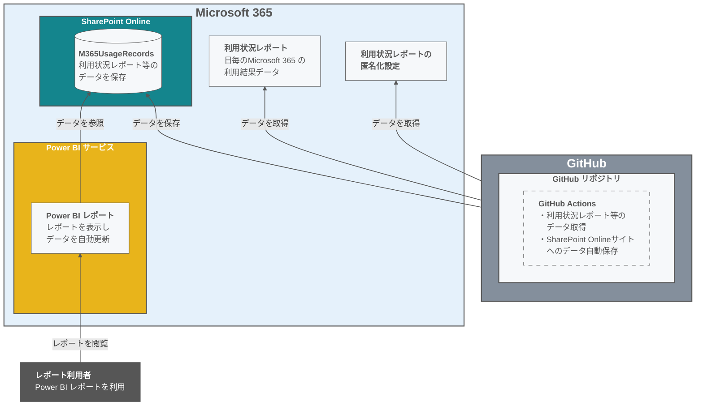

**【レポート画面】　★残　画像差し替え**

||
|---------|

画像の番号ごとにレポートの概要を説明します。

| 番号 | 概要 |
|---------|---------|
| ① | 集計対象の年度を選択します。複数選択も可能です。 |
| ② | 集計対象の学校を選択します。複数選択も可能です。 |
| ③ | 集計対象の利用者区分を選択します。複数選択も可能です。 |
| ④ | 集計対象のデータ期間を表します。 |
| ⑤ | 集計期間において、利用頻度ごとに利用人数を集計します。 |
| ⑥ | 利用頻度毎の利用人数を月別に表示します。 |
| ⑦ | 利用頻度毎の利用人数を機能（アプリ）別に表示します。 |
| ⑧ | 利用頻度毎の利用人数を学校別に表示します。 「+」をクリックすると 役割＞学級＞週 の粒度に分解できます。 |
| ⑨ | 表示しているデータについて、補足や留意事項を記載しています。 |

集計に利用している利用頻度は以下のように定義しています。
| 利用頻度 | 説明 |
|---------|---------|
| 週 5 日以上 | 集計期間の日数のうち、5/7 以上利用している |
| 週 3 日以上 | 集計期間の日数のうち、3/7 以上・5/7 未満利用している |
| 週 1 日以上 | 集計期間の日数のうち、1/7 以上・3/7 未満利用している |
| 月 1 日以上 | 集計期間の日数のうち、12/365 以上・1/7 未満利用している |
| 月 1 日未満 | 集計期間の日数のうち、12/365 未満利用している、または利用していない ※利用していない人数には、Microsoft 365 上に存在する有効なアカウントをすべて含みます。 |

> [!NOTE]
> + 新入生および卒業生は、在籍期間を対象として利用頻度が集計されます。
> + 各ユーザーの所属情報は、年度毎の最新の名簿ファイルに記載されている情報を利用しています。
> + 利用人数の総数は、年度毎の最新の名簿ファイルに記載されているユーザー数から算出しています。

## ✅ 前提条件

Microsoft 365 学校毎の利用状況可視化サンプルを使用するには以下の前提条件を満たす必要があります。

1. **データ蓄積機能の構築**  
   テナントのシステム管理者によって、 [環境構築手順](/README.md#-%E7%92%B0%E5%A2%83%E6%A7%8B%E7%AF%89%E6%89%8B%E9%A0%86) が完了していることを確認してください。

1. **Microsoft 365 アカウント**  
   Power BI Desktop や Power BI サービスにサインインするための有効な Microsoft 365 アカウントが必要です。

2. **Microsoft 365 A1ライセンス**  
   本プロジェクトのレポートを活用するためには、最低でもMicrosoft 365 A1ライセンスが必要です。  

3. **インターネット接続**  
   Power BI Desktop からデータソースとなる SharePoint Online へのアクセスやPower BI サービスのアクセスにインターネット接続が必須です。

4. **Power BI Desktop のインストール**  
   PCに Power BI Desktop がインストールされていることを確認してください。  
   詳細は[こちら（Power BI Desktop の取得 - Power BI | Microsoft Learn）](https://learn.microsoft.com/ja-jp/power-bi/fundamentals/desktop-get-the-desktop) の手順に従ってください。  

> [!IMPORTANT]
> + インストールのための [最小要件（Power BI Desktop の取得 - Power BI | Microsoft Learn）](https://learn.microsoft.com/ja-jp/power-bi/fundamentals/desktop-get-the-desktop#minimum-requirements) を確認して下さい。
> + 端末のメモリ (RAM) が 4 GB 以下だと動作しない可能性があります。

> [!NOTE]
> + Power BI Desktop のインストールにはPCの管理者権限が必要になる場合があります。
> + Power BI Desktop の起動後、「WebView2に問題があります」と表示された場合は以下のMicrosoft Learnを参考にしてください。
>   [Power BI Desktop の起動に関する問題を解決する - Power BI | Microsoft Learn](https://learn.microsoft.com/ja-jp/power-bi/connect-data/desktop-error-launching-desktop)

6. **データソースへのアクセス権**  
   SharePoint Online サイト上のデータソースへのアクセス権限を持っていることを確認してください。

> [!NOTE]
> + データソースとなるサイトのURLは、[環境構築手順　8. 動作確認](/README.md#8-%E5%8B%95%E4%BD%9C%E7%A2%BA%E8%AA%8D) に記載されています。

## 📥 事前準備

### 1. 名簿ファイルの作成

端末の利用状況を学校毎に可視化するためには、各ユーザーのIDや所属情報を含む名簿ファイルが必要になります。  
以下に記載の手順で作成してください。

　クリックして詳細表示　★残対応有り

> 1. [サンプルファイル](名簿サンプル/2024-04-01_M365名簿.xlsx) をダウンロードします。　★本番環境が出来てから 画像を調整
> 2. 名簿作成時の日付でファイル名を「yyyy-mm-dd_M365名簿.xlsx」に変更します。
>
>      - yyyy-mm-ddに名簿作成時の日付を入力します。  
>       例：2025年4月1日にファイルを作成した場合、ファイル名は「2025-04-01_M365名簿.xlsx」となります。
> 
> |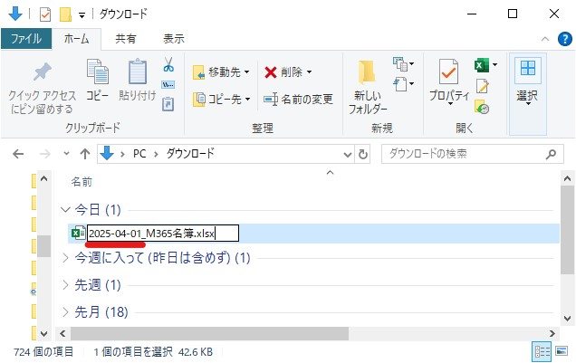|
> |---------|
>
>  3. ファイルに以下の項目を入力します。
>
>      - 記載されているサンプルデータは削除してください。
> 
> | 列名 | 格納されるデータの内容 | 例 | 備考 |
> |---|---|---|---|
> | **年度** | 名簿の対象となる年度 数字4桁 | 2025　など |  |
> | **所属名** | 対象者の所属 | ダミー小学校 教育委員会　など |  |
> | **M365ID** | 対象者のMicrosoft 365 ID | aaaaa@bbb.onmicrosoft.com xxx@yyy.ed.jp　など |  |
> | **氏名** | 対象者の氏名 | 内田　洋子 youko-uchida　など | 空欄でも構いません |
> | **役割** | 対象者の役割・肩書 | 児童生徒 教員 全体管理者　のいずれか |  |
> | **学級名** | 対象者の所属する学級名 | 1年1組 ひまわり学級 など | 相当するものがなければ空欄でも構いません 運用負荷を考慮して一律「未設定」という文言も可能です |
> 
> |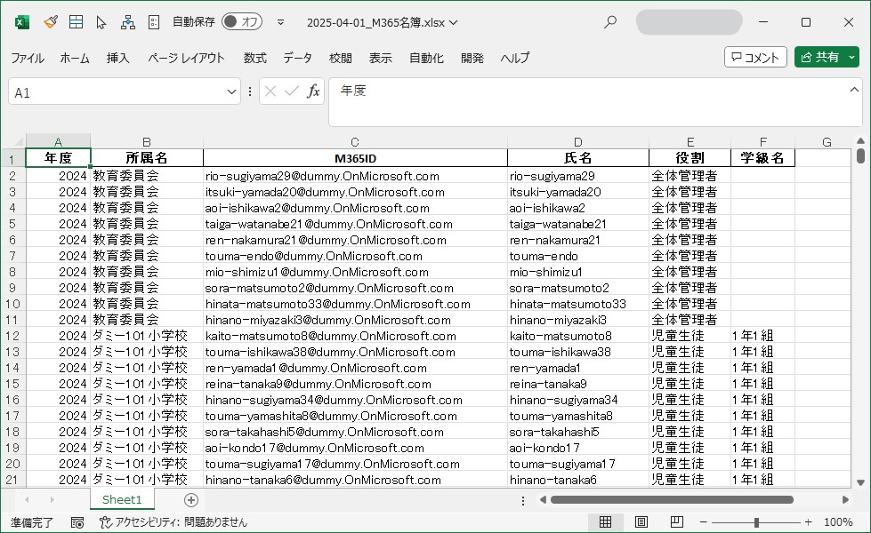|
> |---------|

> [!Note]
> **レポートと名簿ファイルの関連について**  
> + レポートでは、年度毎の最新の名簿ファイルにある情報でデータが集計されます。
> + 各列の情報は、レポートの以下の部分に対応します。
> 
> | 列名 | レポートとの関連 |
> |---|---|
> | 年度 | 集計対象の年度と名簿情報を紐づけます。 |
> | 所属名 | 学校によるフィルターや学校毎の集計に利用します。 |
> | M365ID | Microsoft 365 利用データと名簿情報を紐づけます。 |
> | 氏名 | レポート上には表示しません。 |
> | 役割 | 役割によるフィルターや役割毎の集計に利用します。 |
> | 学級名 | 学級毎の集計に利用します。 空欄や任意の値を入れるとその値で表示されます。（下図参照） |
> 
> ||
> |---------|
>

### 2. 名簿ファイル格納場所の準備

名簿ファイルをSharePoint Online サイトにアップロードすることで、レポートから参照できるようにします。
アップロードするためのフォルダを作成します。

　クリックして詳細表示

> 1. データソースとなるShare Point Online サイトにアクセスします。
>
>    - サイトのURLは、[環境構築手順　8. 動作確認](/README.md#8-%E5%8B%95%E4%BD%9C%E7%A2%BA%E8%AA%8D) に記載されています。
> 
> 2. 左側のタブから、 [ドキュメント] を選択します。
> 
> |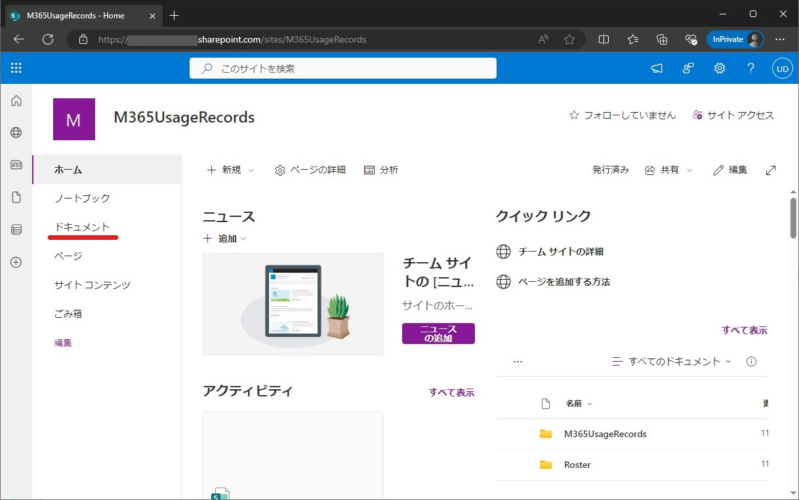|
> |---------|
>
> 3. [＋新規] > [フォルダー] をクリックしてフォルダーの作成画面を開きます。
> 
> |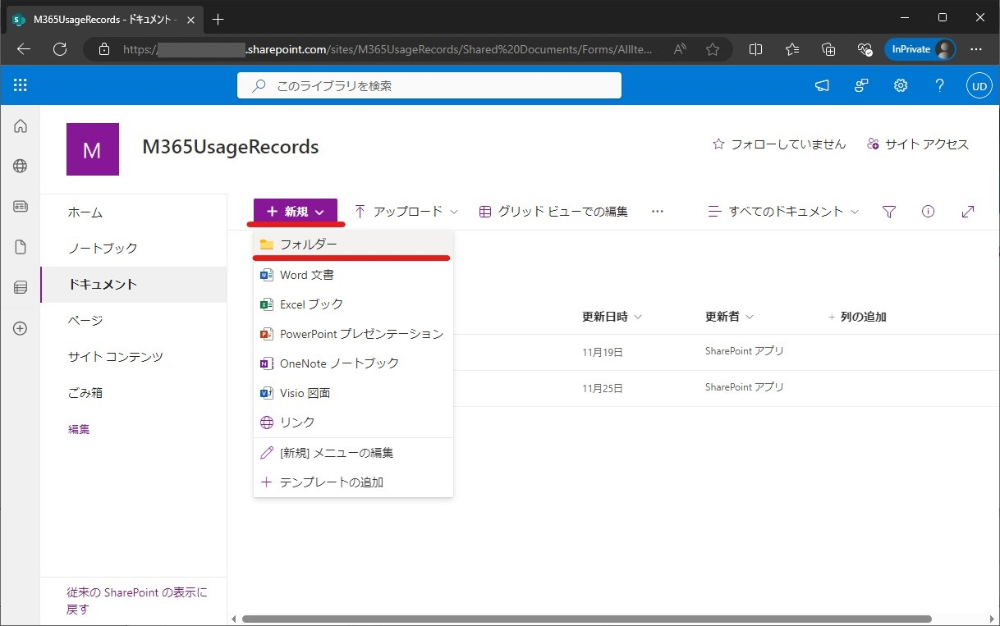|
> |---------|
>
> 4. 名前に「Roster」と入力して [作成] をクリックします。
>
>    - 先頭大文字の半角英字で入力してください。
> 
> |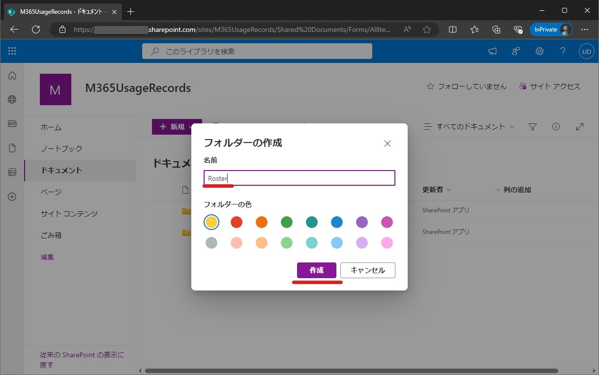|
> |---------|
>
> 5. 作成した「Roster」フォルダーをクリックして開きます。
> 
> |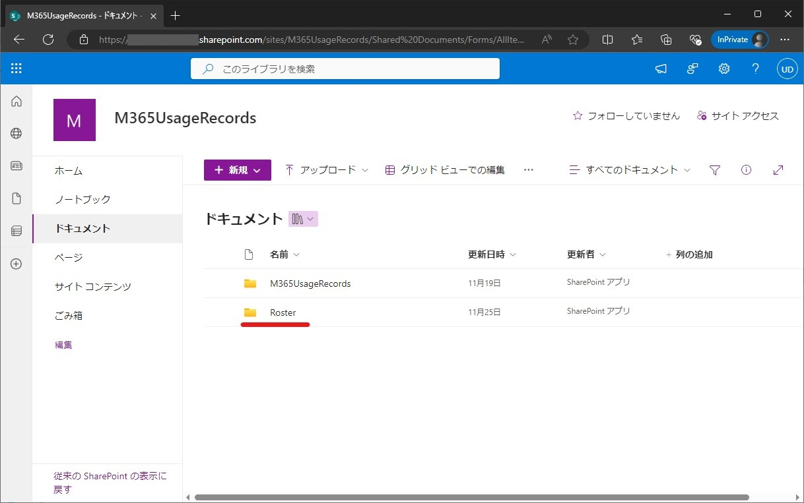|
> |---------|
>
> 6. [＋新規] > [フォルダー] から、「M365名簿」という名前のフォルダーを作成します。
>
>    - 「M」は大文字の半角英字、「365」は半角数字で入力してください。
> 
> ||
> |---------|
>
> 7. 作成した「M365名簿」フォルダーをクリックして開きます。
> 8. [＋新規] > [フォルダー] から、「school_year=yyyy」という名前のフォルダーを作成します。
>
>    - 小文字の半角英字および半角記号で入力してください。
>    - 「yyyy」には登録する名簿の年度が入ります。  
>      2025年度分の名簿ファイルを登録したい場合、「school_year=2025」という名前のフォルダになります。
> 
> |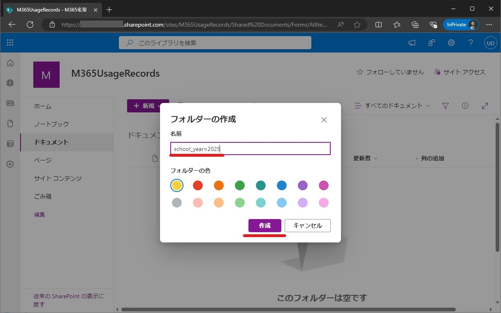|
> |---------|
>

### 3. 名簿ファイルのアップロード

名簿ファイルをSharePoint Online サイトにアップロードします。

　クリックして詳細表示

> 1. 前の手順で作成した「school_year=yyyy」フォルダーをクリックして開きます。
> 
> |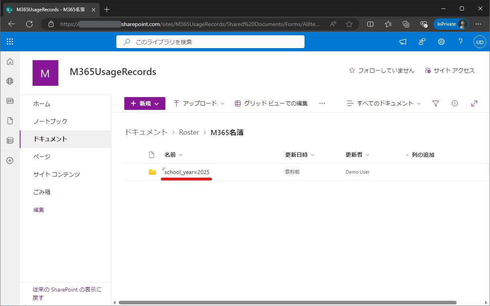|
> |---------|
>
> 2. [アップロード] > [ファイル] をクリックします。
> 
> |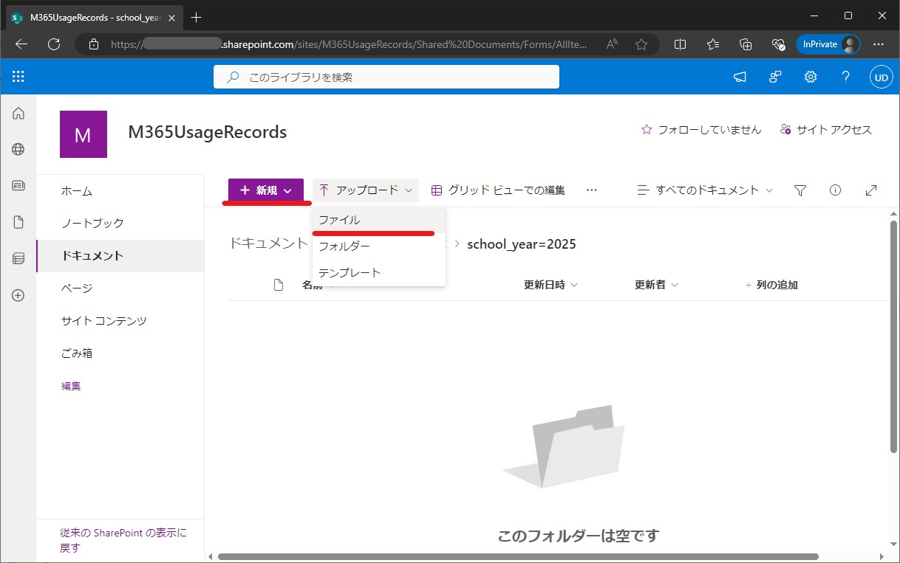|
> |---------|
>
> 3. 名簿ファイルを選択して開きます。
> 
> |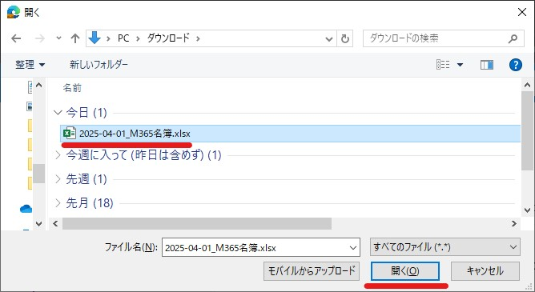|
> |---------|
>
> 4. 名簿ファイルのパスが以下のようになっていることを確認します。
> 
>    - ドキュメント/Roster/M365名簿/school_year=yyyy/yyyy-mm-dd_M365名簿.xlsx
> 
> |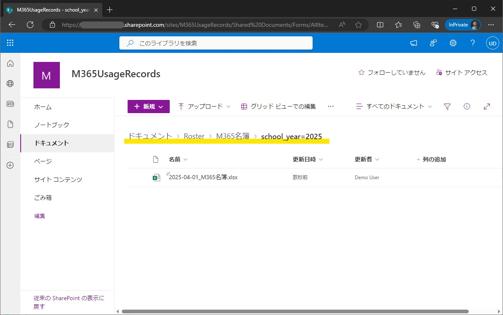|
> |---------|
>

### 2. GitHubからのPBITファイルのダウンロード

レポートを利用開始するために、以下の手順でテンプレートをダウンロードできます。

　クリックして詳細表示　★残対応有り

> 1. [本件のマスタリポジトリ](test.pbit) にアクセスし、対象のPBITファイルをダウンロードします。★本番環境が出来てから 画像とリンクを調整

### 3. Power BI Desktop および Power BI サービスの準備

Power BI Desktop および Power BI サービスの準備に関する手順は、  
「Microsoft 365 テナント全体の利用状況可視化サンプル利用ガイド」の [事前準備](../010_%E3%83%86%E3%83%8A%E3%83%B3%E3%83%88%E3%81%AE%E5%88%A9%E7%94%A8%E7%8A%B6%E6%B3%81%E5%8F%AF%E8%A6%96%E5%8C%96%E3%82%B5%E3%83%B3%E3%83%97%E3%83%AB/README.md#-%E4%BA%8B%E5%89%8D%E6%BA%96%E5%82%99) の 手順2～4 をご確認ください。

## 📝 利用手順

レポート利用開始や閲覧、日々のデータ更新に関する手順は、  
「Microsoft 365 テナント全体の利用状況可視化サンプル利用ガイド」の[利用開始手順](../010_%E3%83%86%E3%83%8A%E3%83%B3%E3%83%88%E3%81%AE%E5%88%A9%E7%94%A8%E7%8A%B6%E6%B3%81%E5%8F%AF%E8%A6%96%E5%8C%96%E3%82%B5%E3%83%B3%E3%83%97%E3%83%AB/README.md#-%E5%88%A9%E7%94%A8%E9%96%8B%E5%A7%8B%E6%89%8B%E9%A0%86) 以降をご確認ください。

## 🔄 名簿情報の更新方法

> [!IMPORTANT]
> 名簿情報に変更が生じた場合、名簿ファイルを新規作成してSharePoint Online サイトに追加する必要があります。
> + **転出入等**  
>   転出入等の事由により年度の途中で名簿ファイルの情報に変更が生じた場合は、名簿ファイルを新規作成してShare Point Online サイトの「school_year=yyyy」フォルダに格納してください。  
>   例）  2025年4月1日に「2025-04-01_M365名簿.xlsx」を作成している状態で、2025年9月1日に児童生徒の転出入があった場合、  
> 　　 別途「2025-09-01_M365名簿.xlsx」を作成し、Share Point Online サイトの「school_year=2025」フォルダに追加します。
> 
> |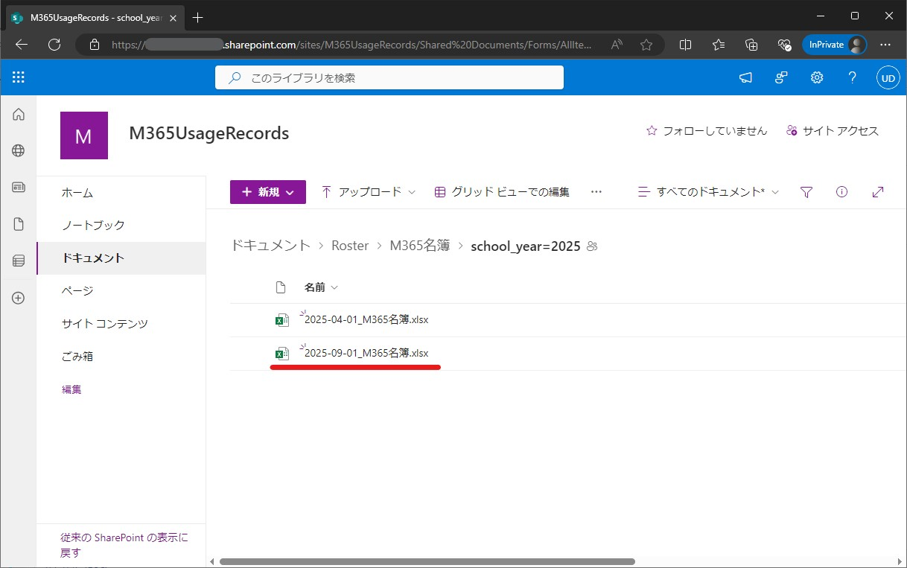|
> |---------|
>
> + **年度の切り替わり**  
>   SharePoint Online サイトに「school_year=yyyy」フォルダを作成し、新年度の情報を記載した名簿ファイルを格納してください。  
>   例）  2026年度になったら、Share Point Online サイトに「school_year=2026」というフォルダを新規作成します。  
> 　　 2026年度の名簿ファイル「2026-04-01_M365名簿.xlsx」も新規作成し、「school_year=2026」フォルダに格納します。
> 
> |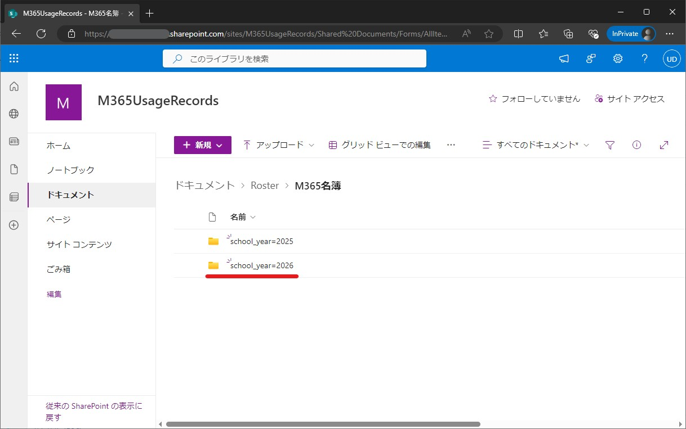|
> |---------|
>
> 操作手順は上述「事前準備」の以下の手順を参考にしてください。
> + [1. 名簿ファイルの作成](#1-名簿ファイルの作成)
> + [2. 名簿ファイル格納場所の準備](#2-名簿ファイル格納場所の準備)
> + [3. 名簿ファイルのアップロード](#3-名簿ファイルのアップロード)

> [!NOTE]
> 集計対象の年度の名簿ファイルが存在しない場合、レポート画面にエラーが表示されます。  
> エラーが表示された場合は、名簿ファイルがSharePoint Online サイトに登録されていることを確認してください。
> 
> |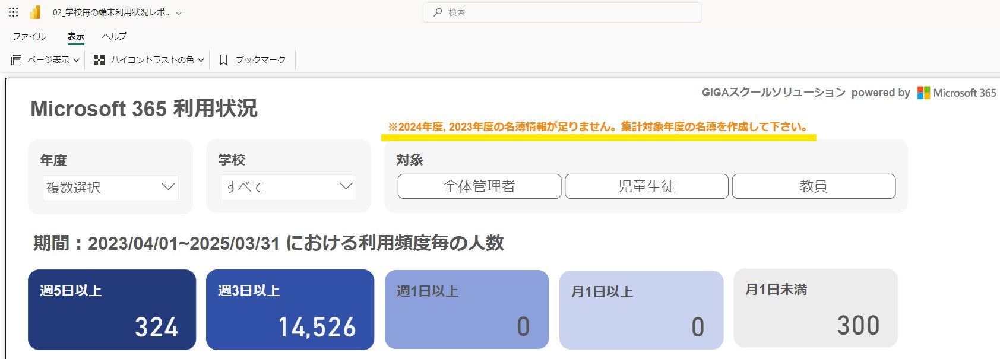|
> |---------|

## ⚠ 注意事項

> [!CAUTION]
> + データを取り込んだレポートファイル (.pbix) は第三者に共有しないで下さい。含まれる情報が意図せず閲覧されてしまいます。

## 📚 関連情報

本プロジェクトに関連するドキュメント

- [Power BI Desktop と Power BI サービスの比較 - Power BI | Microsoft Learn](https://learn.microsoft.com/ja-jp/power-bi/fundamentals/service-service-vs-desktop)
- [Power BI Desktop のインストールガイド（Power BI Desktop の取得 - Power BI | Microsoft Learn）](https://learn.microsoft.com/ja-jp/power-bi/fundamentals/desktop-get-the-desktop)

[Back to top](#top)
